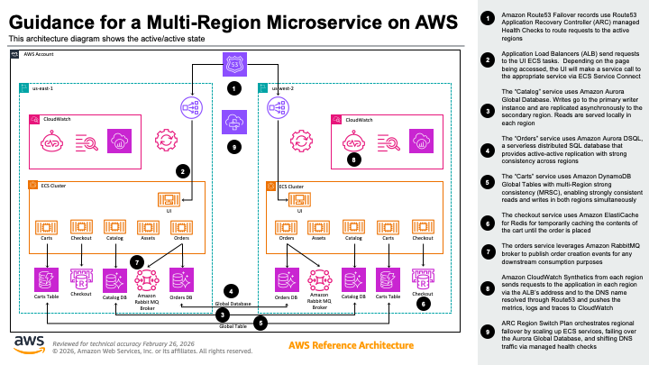
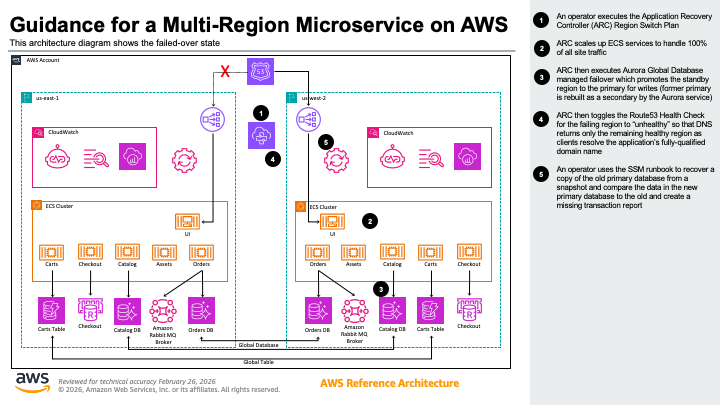
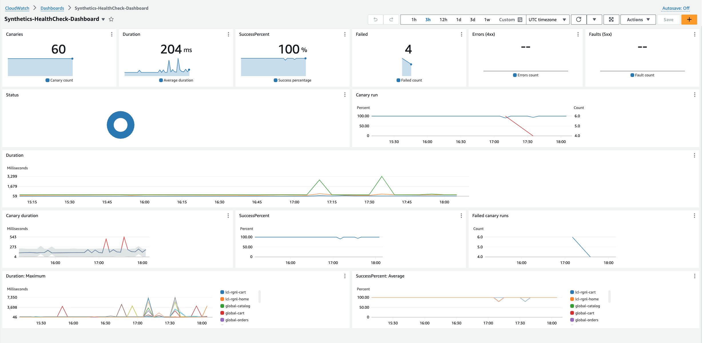
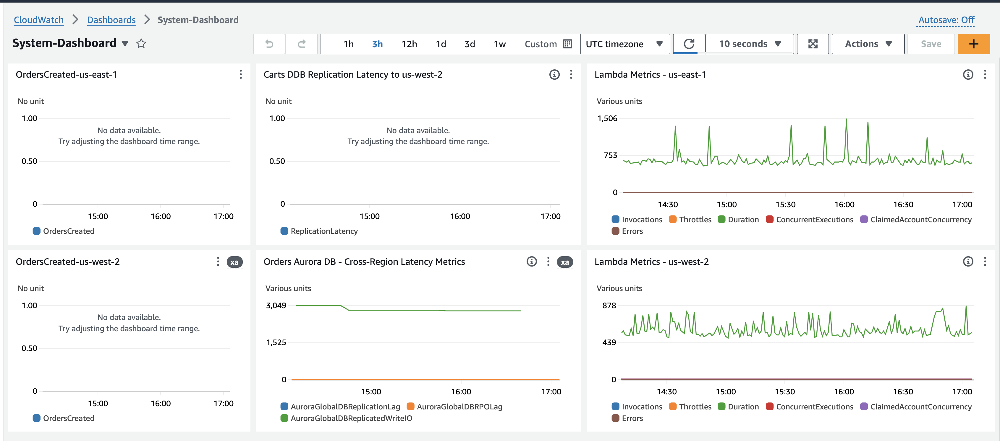

# Guidance for a Multi-Region Microservice on AWS

## Getting started

This guidance helps customers design and operate a multi-Region microservice based architecture for an e-commerce platform on AWS using services like Amazon Elastic Container Services (ECS), Amazon Aurora Global Database, Amazon Aurora DSQL, Amazon DynamoDB Global Tables with multi-Region strong consistency (MRSC), and Route53 Application Recovery Controller (ARC) Region Switch. The solution is deployed across two Regions in an active/active configuration where both regions serve traffic simultaneously. This is possible because all services except Catalog are either stateless or use globally strongly consistent datastores (Aurora DSQL for Orders, DynamoDB Global Tables with MRSC for Carts). The Catalog service uses Amazon Aurora Global Database, which is sufficient for active/active because catalog data is read in-region and updated infrequently by an external process — in the event of data loss due to failover, updates can be re-run. The solution leverages Amazon Route 53 ARC Region Switch Plan to orchestrate regional failover through an automated workflow that scales up ECS services in the target region, fails over the Aurora Global Database, and shifts DNS traffic via Route53 health checks.

## Application Overview

The sample application is an e-commerce platform. The front-end runs as a service in Amazon Elastic Container Service (ECS), supported by back-end microservices (catalog, assets, orders, carts, checkout) for displaying products, adding items to carts, and placing orders. The application uses Amazon Aurora Global Database for the Catalog service, Amazon Aurora DSQL for the Orders service, and Amazon DynamoDB Global Tables with multi-Region strong consistency for the Carts service.


## Architecture

### 1. Operating in the active/active state



1. Amazon Route53 Failover records use Route53 Application Recovery Controller (ARC) managed Health Checks to route requests to the active regions

2. Application Load Balancers (ALB) send requests to the UI tasks on Amazon Elastic Container Service (ECS).  Depending on the page being accessed, the UI will make a service call to the appropriate service via ECS Service Connect

3. The “Catalog” service uses Amazon Aurora Global Database. Writes go to the primary writer instance and are replicated asynchronously to the secondary region. Reads are served locally in each region.

4. The “Orders” service uses Amazon Aurora DSQL, a serverless distributed SQL database that provides active-active replication with strong consistency across regions.

5. The “Carts” service uses Amazon DynamoDB Global Tables with multi-Region strong consistency (MRSC), enabling strongly consistent reads and writes in both regions simultaneously.

6. The checkout service uses Amazon ElastiCache for Redis for temporarily caching the contents of the cart until the order is placed.

7. The orders service leverages Amazon RabbitMQ broker to publish order creation events for any downstream consumption purposes.

8. Amazon CloudWatch Synthetics from each region sends requests to the application in each region via the ALB’s address and to the DNS name resolved through Route53 and pushes the metrics, logs and traces to CloudWatch.

9. Amazon Application Recovery Controller (ARC) Region Switch Plan orchestrates regional failover by scaling up ECS services, failing over the Aurora Global Database, and shifting DNS traffic via managed health checks.


### 2. Cross Region Failover 



1. An operator initiates the Amazon Application Recovery Controller (ARC) Region Switch Plan execution targeting the healthy region. The plan first scales up ECS services in the target region to absorb all traffic.

2. The plan executes Amazon Aurora Global Database managed failover, which promotes the secondary region to the primary for writes. The former primary is rebuilt as a secondary by the Aurora service.

3. The plan shifts DNS traffic by updating Route53 managed health checks, causing the failing region’s health check to enter a “Failed” state. Amazon Route53 returns only the healthy region as clients resolve the application’s fully-qualified domain name.


## Pre-requisites

* To deploy this example guidance, you need an AWS account (We suggest using a temporary or a development account to 
  test this guidance), and a user identity with access to the following services:

    * AWS CloudFormation
    * Amazon Virtual Private Cloud (VPC)
    * Amazon Elastic Compute Cloud (EC2)
    * Amazon Elastic Container Services (ECS)
    * Amazon Relational Database Service (RDS)
    * Amazon ElastiCache for Redis
    * Amazon Aurora Global Database 
    * AWS Identity and Access Management (IAM)
    * AWS Secrets Manager
    * AWS Systems Manager
    * Amazon Route 53
    * AWS Lambda
    * Amazon CloudWatch
    * Amazon Simple Storage Service
* Install the latest version of AWS CLI v2 on your machine, including configuring the CLI for a specific account and region
profile.  Please follow the [AWS CLI setup instructions](https://github.com/aws/aws-cli).  Make sure you have a 
default profile set up; you may need to run `aws configure` if you have never set up the CLI before. 

* Install Python version 3.12 on your machine. Please follow the [Download and Install Python](https://www.python.org/downloads/) instructions.

* Install `make` for your OS if it is not already there.

* Install `zip` for your OS if it is not already there (used to package source for AWS CodeBuild). Container images are built via AWS CodeBuild — no local Docker installation is required.

### Regions

This demonstration by default uses `us-east-1` as the primary region and `us-west-2` as the backup region. These can be changed in the Makefile.

## Deployment

For the purposes of this workshop, we deploy the CloudFormation Templates via a Makefile. For a production workload, you'd want to have an automated deployment pipeline.  As discussed in this 
[article](https://aws.amazon.com/builders-library/automating-safe-hands-off-deployments/?did=ba_card&trk=ba_card), a multi-region pipeline should follow a staggered deployment schedule to reduce the blast radius of a bad deployment.  
Take particular care with changes that introduce possibly backwards-incompatible changes like schema modifications, and make use of schema versioning.


## Configuration
Before starting deployment process please update the following variables in the `deployment/Makefile`:

**ENV** - It is the unique variable that indicates the environment name. Global resources created, such as S3 buckets, use this name. (ex: -dev)

**PRIMARY_REGION** - The AWS region that will serve as primary for the workload

**STANDBY_REGION** - The AWS region that will serve as standby or failover for the workload

## Deployment Steps

We use make file to automate the deployment commands. The make file is optimized for Mac. If you plan to deploy the solution from another OS, you may have to update few commands.

1. Deploy the full solution from the `deployment` folder
    ```shell
    make deploy
    ```

## Verify the deployment

**Deployment Outputs**

Verify deployment outputs after a successful deployment. If you are deploying the solution to **us-east-1** a sample deployment output will look like this:- 

Canaries:
* https://us-east-1.console.aws.amazon.com/cloudwatch/home?region=us-east-1#synthetics:canary/list
* https://us-west-2.console.aws.amazon.com/cloudwatch/home?region=us-west-2#synthetics:canary/list

Clients for in-VPC Browser:
* https://us-east-1.console.aws.amazon.com/systems-manager/fleet-manager/managed-nodes?region=us-east-1
* https://us-west-2.console.aws.amazon.com/systems-manager/fleet-manager/managed-nodes?region=us-west-2

Administrator user passwords:
* https://us-east-1.console.aws.amazon.com/secretsmanager/secret?name=mr-app-windowspassword-us-east-1&region=us-east-1
* https://us-west-2.console.aws.amazon.com/secretsmanager/secret?name=mr-app-windowspassword-us-west-2&region=us-west-2

Region Switch Plan:
* Use `aws arc-region-switch start-plan-execution` to initiate failover

## Observability

Each Region is provisioned with a CloudWatch dashboard that shows the healthchecks as reported by the Synthetic Canaries in each Region. 



In addition, a System Dashboard is also provisioned that shows key metrics like the Order created in each Region, and the replication latency metrics for 
DynamoDB and Aurora Global database.



## Injecting Chaos to simulate failures
To induce failures into your environment, you can use the `multi-region-scenario.yml` and cause a regional service disruption. This cloudformation template uses AWS Fault Injection Service to simulate disruptions like pausing DynamoDB Global Table replication and disrupting cross region network connectivity from subnets. Running this experiment will also allow you to perform a Regional failover and observe the reconciliation process.

The chaos experiment template is already deployed as part of the solution deployment process.

The following sequence of steps can be used to test this solution.

1. The first step is to get the experimentTemplateId to use in our experiment; use the below command for that and make a note of the id value
`export templateId=$(aws fis list-experiment-templates --output json --no-cli-pager | jq -r '.experimentTemplates[] | select(.tags["Name"] == "Cross-Region: Connectivity to us-west-2") | .id')`

2. Execute the experiment in the primary Region (us-east-1) using the following command using the templateId from the previous step.
`aws fis start-experiment --experiment-template-id $templateId`

## Cleanup

Note: If you have created reconciliation Amazon Aurora Database Clusters and Database Instances in the Standby Region, please delete all those instances before going to the next step.

Delete all the cloudformation stacks and associated resources from both the Regions, by running the following command from the `deployment` folder
    ```shell
    make destroy-all
    ```

## Cost

The following table provides a sample cost breakdown for trying out this guidance package with the default parameters in the US East (N. Virginia) Region and US West (Oregon) Region. 

## Summary
| Cost Type | Amount (USD) |
|-----------|-------------|
| Upfront Cost | $0.00 |
| Monthly Cost | $868.77 |
| Total 12 Months Cost* | $10,425.24 |

\* Includes upfront cost

## Detailed Estimate

### US East (N. Virginia) Region

| Service | Monthly Cost | 12 Month Total | Configuration |
|---------|-------------|----------------|---------------|
| AWS Fargate | $216.24 | $2,594.88 | Linux, x86, 1 day duration, 6 tasks/day, 2GB memory, 20GB storage |
| Application Load Balancer | $16.44 | $197.28 | 1 ALB |
| Aurora MySQL | $179.98 | $2,159.76 | Aurora Standard, 2 instances, 1GB storage each |
| DynamoDB | $0.28 | $3.36 | Standard table, 1KB item size, 1GB storage |
| DynamoDB Streams | $0.0006 | $0.01 | 100 GetRecord API requests/day |
| AWS FIS | $2.00 | $24.00 | 20 action-minutes/experiment, 1 target account |
| Parameter Store | $0.00 | $0.00 | 50 standard parameters |
| Secrets Manager | $20.00 | $240.00 | 50 secrets, 30-day duration |
| KMS | $1.0003 | $12.00 | 1 CMK, 100 symmetric requests |
| AWS CodeBuild | $1.00 | $12.00 | ~6 builds x ~5 min, BUILD_GENERAL1_MEDIUM ($0.005/min) |

### US West (Oregon) Region

| Service | Monthly Cost | 12 Month Total | Configuration |
|---------|-------------|----------------|---------------|
| AWS Fargate | $216.24 | $2,594.88 | Linux, x86, 1 day duration, 6 tasks/day, 2GB memory, 20GB storage |
| Application Load Balancer | $17.89 | $214.68 | 1 ALB |
| Aurora MySQL | $175.42 | $2,105.04 | Aurora Standard, 2 instances, 1GB storage each |
| DynamoDB | $0.28 | $3.36 | Standard table, 1KB item size, 1GB storage |
| DynamoDB Streams | $0.0006 | $0.01 | 100 GetRecord API requests/day |
| AWS FIS | $2.00 | $24.00 | 20 action-minutes/experiment, 1 target account |
| Parameter Store | $0.00 | $0.00 | 50 standard parameters |
| Secrets Manager | $20.00 | $240.00 | 50 secrets, 30-day duration |
| KMS | $1.0003 | $12.00 | 1 CMK, 100 symmetric requests |

## Acknowledgement
*AWS Pricing Calculator provides only an estimate of your AWS fees and doesn't include any taxes that might apply. Your actual fees depend on a variety of factors, including your actual usage of AWS services.*
*More than 100 AWS products are available on AWS Free Tier today. Click [here](https://aws.amazon.com/free/) to explore our offers.*

*Note: We recommend creating a [Budget](https://docs.aws.amazon.com/cost-management/latest/userguide/budgets-managing-costs.html) through [AWS Cost Explorer](https://aws.amazon.com/aws-cost-management/aws-cost-explorer/) to help manage costs. Prices are subject to change. For full details, refer to the pricing webpage for each AWS service used in this Guidance.*

## Security
See [CONTRIBUTING](CONTRIBUTING.md) for more information.

### Considerations

The codebase does not address these CDK_NAG rules since this code is NOT INTENDED for Production usage. The codebase has been created with the sole intention of demonstrating multi-Region architectural patterns with the assumption that the end-user will harden the codebase to meet the security considerations as required.

| Rule ID            | Cause                                                                                                                         | Explanation                                                                                                                                                                                                                                                                                                           |
| ------------------ |-------------------------------------------------------------------------------------------------------------------------------|-----------------------------------------------------------------------------------------------------------------------------------------------------------------------------------------------------------------------------------------------------------------------------------------------------------------------|
| AwsSolutions-SMG4  | The secret does not have automatic rotation scheduled for resources ARNs being stored as secrets.                             | The demo code leverages secrets manager to share information about AWS resources like ARNs across Regions. Such secrets are not eligible for rotation. However, Aurora databases credentials being used and setup for rotation using the [secrets-rotation](deployment/database/secrets-rotation) stack.              |
| AwsSolutions-IAM5  | The IAM entity contains wildcard permissions and does not have a cdk-nag rule suppression with evidence for those permission. | IAM role and permissions used by services like the AWS Fault Injection Service are scoped not a specific resources because multiple resources will get affected when simulating a regional power outage scenario. In cases such as these, the permissions are restricted to resources within the same account though. |
| AwsSolutions-IAM4  | The IAM user, role, or group uses AWS managed policies.                                                                       | This is a demo codebase, hence using AWS managed policies where possible.                                                                                                                                                                                                                                             |
| AwsSolutions-RDS10 | The RDS instance or Aurora DB cluster does not have deletion protection enabled.                                              | This is a demo codebase, hence deletion protection is not enabled.                                                                                                                                                                                                                                                    |
| AwsSolutions-RDS11 | The RDS instance or Aurora DB cluster uses the default endpoint port.                                                         | This is a demo codebase, hence default ports are used for RDS.                                                                                                                                                                                                                                                        |
| AwsSolutions-RDS14 | The RDS Aurora MySQL cluster does not have Backtrack enabled.                                                                 | This is a demo codebase, hence backtracking is not enabled.                                                                                                                                                                                                                                                           |

## License
This library is licensed under the MIT-0 License. See the [LICENSE](LICENSE) file.