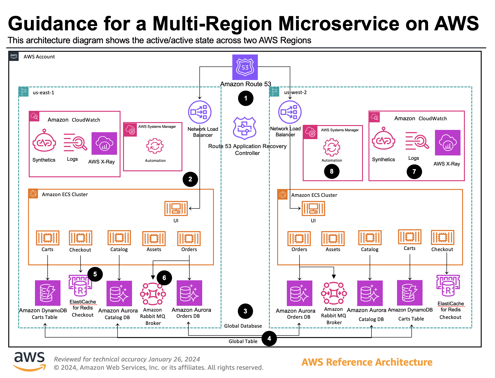
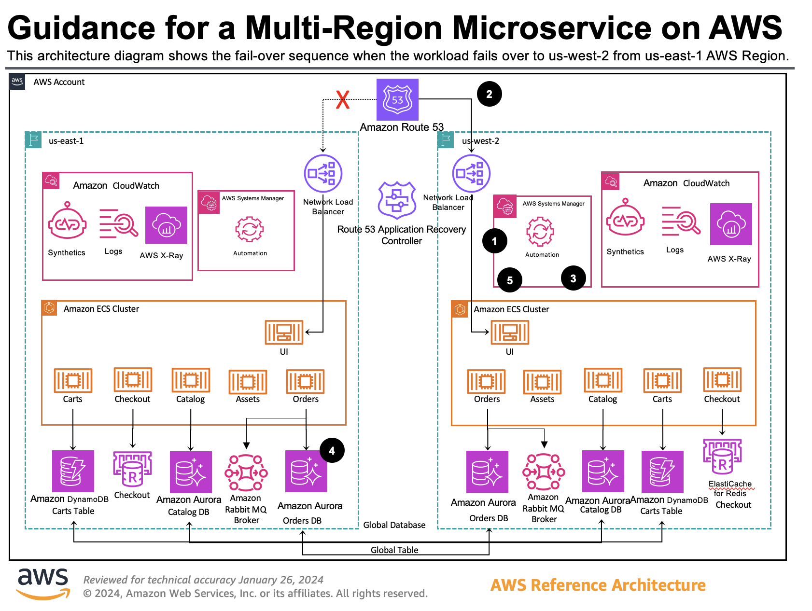
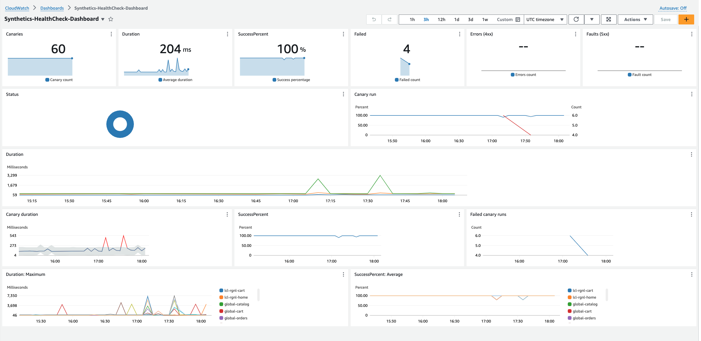
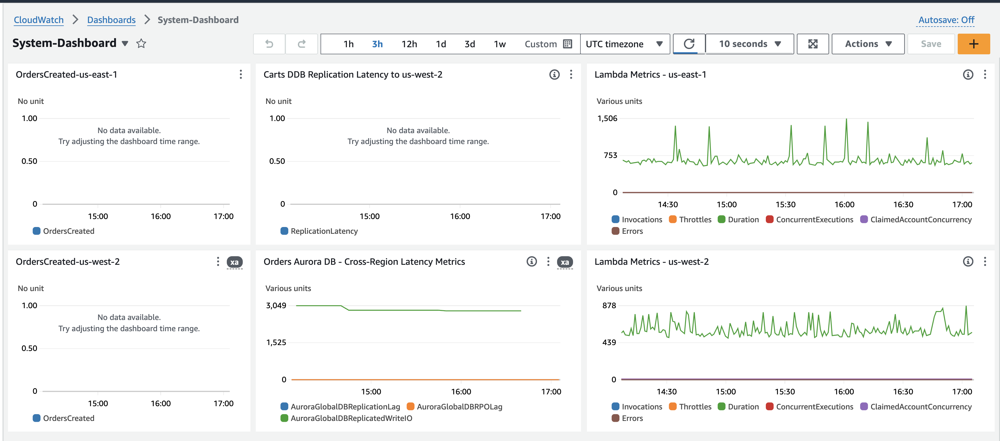

# Guidance for a Multi-Region Microservice on AWS

## Getting started

This guidance helps customers design and operate a multi-Region microservice based architecture for an e-commerce platform on AWS using services like Amazon Elastic Container Services, Amazon Aurora Global Tables, Route53 Application Recovery Controller (ARC) and Lambda functions. The solution is deployed across two Regions that can failover and failback from one Region to another in an automated fashion. It leverages Amazon Route 53 Application Recovery Controller to help with the regional failover using AWS Systems Manager document (SSM). AWS Systems Manager (SSM) runbook  toggles the Route53 Application Recovery Controller (ARC) routing control “off” which causes the managed Health Check for the region to enter a “Failed” state. SSM runbook executes Aurora Global Database managed failover which promotes the standby region to the primary for writes. SSM runbook recovers a copy of the old primary database from a snapshot and reconcile the data in the new primary database to the old and generates a missing transaction report. 

## Application Overview

The sample application used for this prespective guidence is an e-commerce platform. The front-end of the applications runs as a service in an Amazon Elastic Container(ECS) supported by back-end micro-services 
e.g. catalog, assets, orders, cats, checkout to support flows like displaying lists of available products, adding products to carts and finally placing and order. The application is supported by two Amazon Aurora Global database clusters running inastances of Catalog and Orders. 


## Architecture

### 1. Operating in the active/active state



1. Amazon Route53 Failover records use Route53 Application Recovery Controller (ARC) managed Health Checks to route requests to the active regions

2. Application Load Balancers (ALB) send requests to the UI tasks on Amazon Elastic Container Service (ECS).  Depending on the page being accessed, the UI will make a service call to the appropriate service via ECS Service Connect

3. As records are written to the writer instances of the  “Catalog” and “Orders” Amazon Aurora global databases, they are replicated to the standby clusters

4. As records are written to the “Carts” Amazon DynamoDB global table in one region, they are replicated to the table in the other region

5. The checkout service uses Amazon ElastiCache for Redis for temporarily caching the contents of the cart until the order is placed.

6. The orders service leverages Amazon RabbitMQ broker to publish order creation events for any downstream consumption purposes.

7. Amazon CloudWatch Synthetics from each region sends requests to the application in each region via the ALB’s address and to the DNS name resolved through Route53 and pushes the metrics, logs and traces to CloudWatch.

8. AWS Systems Manager Automation Runbooks automate the enabling and disabling of the ARC routing controls and the failing-over of the Aurora Global Databases


### 2. Cross Region Failover 



1. AWS Systems Manager (SSM) runbook (triggered by an operator manually)  toggles the Route53 Application Recovery Controller (ARC) routing control “off” which causes the managed Health Check for the region to enter a “Failed” state.

2. Amazon Route53 returns only the remaining healthy region as clients resolve the application’s fully-qualified domain name.

3. SSM runbook executes Amazon Aurora Global Database managed failover which promotes the standby region to the primary for writes

4. Former primary is rebuilt as a secondary by the Aurora service

5. SSM runbook recovers a copy of the old primary database from a snapshot and compares the data in the new primary database to the old and creates a missing transaction report


## Pre-requisites

* To deploy this example guidance, you need an AWS account (We suggest using a temporary or a development account to 
  test this guidance), and a user identity with access to the following services:

    * AWS CloudFormation
    * Amazon Virtual Private Cloud (VPC)
    * Amazon Elastic Compute Cloud (EC2)
    * Amazon Elastic Container Services (ECS)
    * Amazon Relational Database Service (RDS)
    * Amazon ElastiCache for Redis
    * Amazon Aurora Global Database 
    * AWS Identity and Access Management (IAM)
    * AWS Secrets Manager
    * AWS Systems Manager
    * Amazon Route 53
    * AWS Lambda
    * Amazon CloudWatch
    * Amazon Simple Storage Service
* Install the latest version of AWS CLI v2 on your machine, including configuring the CLI for a specific account and region
profile.  Please follow the [AWS CLI setup instructions](https://github.com/aws/aws-cli).  Make sure you have a 
default profile set up; you may need to run `aws configure` if you have never set up the CLI before. 

* Install Python version 3.12 on your machine. Please follow the [Download and Install Python](https://www.python.org/downloads/) instructions.

* Install `make` for your OS if it is not already there.

* Install Docker Desktop on your machine. Please follow the [Download and Install Docker Desktop](https://www.docker.com/products/docker-desktop/) instructions.

### Regions

This demonstration by default uses `us-east-1` as the primary region and `us-west-2` as the backup region. These can be changed in the Makefile.

## Deployment

For the purposes of this workshop, we deploy the CloudFormation Templates via a Makefile. For a production workload, you'd want to have an automated deployment pipeline.  As discussed in this 
[article](https://aws.amazon.com/builders-library/automating-safe-hands-off-deployments/?did=ba_card&trk=ba_card), a multi-region pipeline should follow a staggered deployment schedule to reduce the blast radius of a bad deployment.  
Take particular care with changes that introduce possibly backwards-incompatible changes like schema modifications, and make use of schema versioning.


## Configuration
Before starting deployment process please update the following variables in the `deployment/Makefile`:

**ENV** - It is the unique variable that indicates the environment name. Global resources created, such as S3 buckets, use this name. (ex: -dev)

**PRIMARY_REGION** - The AWS region that will serve as primary for the workload

**STANDBY_REGION** - The AWS region that will serve as standby or failover for the workload

## Deployment Steps

We use make file to automate the deployment commands. The make file is optimized for Mac. If you plan to deploy the solution from another OS, you may have to update few commands.

1. Deploy the full solution from the `deployment` folder
    ```shell
    make deploy
    ```

## Verify the deployment

**Deployment Outputs**

Verify deployment outputs after a successful deployment. If you are deploying the solution to **us-east-1** a sample deployment output will look like this:- 

Canaries:
* https://us-east-1.console.aws.amazon.com/cloudwatch/home?region=us-east-1#synthetics:canary/list
* https://us-east-1.console.aws.amazon.com/cloudwatch/home?region=us-west-2#synthetics:canary/list

Clients for in-VPC Browser:
* https://us-east-1.console.aws.amazon.com/systems-manager/fleet-manager/managed-nodes?region=us-east-1
* https://us-west-2.console.aws.amazon.com/systems-manager/fleet-manager/managed-nodes?region=us-west-2

Administrator user passwords:
* https://us-east-1.console.aws.amazon.com/secretsmanager/secret?name=mr-app-windowspassword-us-east-1&region=us-east-1
* https://us-west-2.console.aws.amazon.com/secretsmanager/secret?name=mr-app-windowspassword-us-west-2&region=us-west-2

SSM Runbooks for failover execution:
* https://us-east-1.console.aws.amazon.com/systems-manager/documents
* https://us-west-2.console.aws.amazon.com/systems-manager/documents

## Observability

Each Region is provisioned with a CloudWatch dashboard that shows the healthchecks as reported by the Synthetic Canaries in each Region. 



In addition, a System Dashboard is also provisioned that shows key metrics like the Order created in each Region, and the replication latency metrics for 
DynamoDB and Aurora Global database.



## Injecting Chaos to simulate failures
To induce failures into your environment, you can use the `multi-region-scenario.yml` and cause a regional service disruption. This cloudformation template uses AWS Fault Injection Service to simulate disruptions like pausing DynamoDB Global Table replication and disrupting cross region network connectivity from subnets. Running this experiment will also allow you to perform a Regional failover and observe the reconciliation process.

The chaos experiment template is already deployed as part of the solution deployment process.

The following sequence of steps can be used to test this solution.

1. The first step is to get the experimentTemplateId to use in our experiment; use the below command for that and make a note of the id value
`export templateId=$(aws fis list-experiment-templates --query='experimentTemplates[?tags.Name==`Cross-Region: Connectivity to us-west-2`].{id: id}' --output text)`

2. Execute the experiment in the primary Region (us-east-1) using the following command using the templateId from the previous step.
`aws fis start-experiment --experiment-template-id $templateId`

## Cleanup

Note: If you have created reconciliation Amazon Aurora Database Clusters and Database Instances in the Standby Region, please delete all those instances before going to the next step.

Delete all the cloudformation stacks and associated resources from both the Regions, by running the following command from the `deployment` folder
    ```shell
    make destroy-all
    ```

## Security
See [CONTRIBUTING](CONTRIBUTING.md) for more information.

## License
This library is licensed under the MIT-0 License. See the [LICENSE](LICENSE) file.